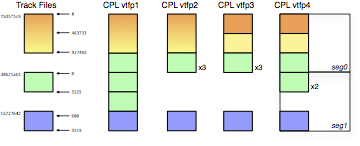

# IMF Virtual Track Fingerprint

   * [Status](#status)
   * [Introduction](#introduction)
   * [Normative References](#normative-references)
   * [Virtual Track Fingerprint](#virtual-track-fingerprint)
      * [Timeline Digest Algorithm](#timeline-digest-algorithm)
      * [Text Encoding](#text-encoding)
      * [URI Encoding](#uri-encoding)
        * [URN Example](#urn-example)
   * [IMF-VTRACK-FP URN](#vtrack-fp-digest-urn)
      * [Purpose](#purpose)
      * [IMF-VTRACK-FP URN NID](#vtrack-fp-digest-urn-nid)
      * [IMF-VTRACK-FP URN NSS](#vtrack-fp-digest-urn-nss)
  * [Matching](#matching)
      * [Lexical Equivalence](#lexical-equivalence)
      * [Abbreviated Thumbprint Values](#abbreviated-thumbprint-values)
         * [Abbreviated URN Example](#abbreviated-urn-example)
   * [Reference Implementation](#reference-implementation)
   * [Test Material](#test-material)
   * [Bibliography](#bibliography)

## Status

This DRAFT proposal describes a method for use by IMF applications.
At this time the proposal is open for comment. If the proposal is adopted by a
sufficiently large subset of the IMF community this proposal will then be submitted to
[SMPTE](https://www.smpte.org) for publication as standard (ST) engineering document.
Substantial changes to this proposal might occur during this process, and
implementors are cautioned against making permanent implementation
or deployment decisions based on its current contents.

This document and associated reference implementation are hosted on
[github](https://github.com/cinecert/imf-vtfp).

## Introduction

It is frequently useful to compare the timelines of virtual tracks selected from two IMF
Composition Playlists (CPL, SMPTE ST 2067-3), such as a comparison between the `MainImage` virtual track
in an original version CPL and its counterpart in a derivative CPL version.
In cases where the comparison is made to determine equality (or the lack thereof),
the comparison can be made by proxy, using computed values that are
a function of the respective timeline contents.
These values can be designed to uniquely identify a particular timeline
by its access to edit units in the referenced IMF track file(s).
Such values are therefore useful as an identifier, or fingerprint,
of a given timeline among sets of CPLs,
which can be useful metadata in the media manufacturing process.

This proposal defines such a fingerprint in two parts. The first part is a message
digest over a canonical iteration of the timeline elements comprising a virtual track.
The second part is a URI encoding of that digest.
Used together, the parts allow exchange of fingerprint
values between disparate implementations with no loss of specificity or accuracy.

The proposed method of canonical timeline iteration is designed to produce a consistent
output for equivalent timelines that may be encoded in a CPL using markup and features
that do not affect the timeline contents, e.g., the use of `Segment` elements in the CPL syntax.

The URI encoding is restricted to single-octet UTF-8 characters, and uses only
alphanumeric characters, '-' (dash), and ':' (colon).

To promote utility the URN encoding allows the values to be truncated
for brevity in cases where the probability of collision is small or otherwise
not significant. Provision is made for comparison of two values having unequal length.


## Normative References

[SMPTE ST 2029:2009 — Uniform Resource Names for SMPTE Resources](https://doi.org/10.5594/SMPTE.ST2029.2009)

[SMPTE ST 2067-3:2020 — Interoperable Master Format - Composition Playlist](https://doi.org/10.5594/SMPTE.ST2067-3.2020)

[ISO/IEC 10118-3:2004 Information technology — Security techniques — Hash-functions — Part 3: Dedicated hash-functions](https://www.iso.org/standard/39876.html)

[IETF RFC 4122 — A Universally Unique IDentifier (UUID) URN Namespace](https://datatracker.ietf.org/doc/html/rfc4122)

[IETF RFC 5234 — Augmented BNF for Syntax Specifications: ABNF](https://www.ietf.org/rfc/rfc5234.txt)

[Unicode® 14.0.0](https://www.unicode.org/versions/Unicode14.0.0/)


## Virtual Track Fingerprint

### Defined Terms

The following symbols are defined by SMPTE ST 2067-3 Composition Playlist:
`Resource`, `TrackFileId`, `EntryPoint`, `SourceDuration`, and `RepeatCount`.

### Timeline Digest Algorithm

#### Description

A virtual track timeline is prepared for message digest by canonicalization of the CPL
Resources that comprise the timeline. This procedure joins contiguous Resources and consolidates
adjacent Resources that repeat the same range of edit units.
The canonicalization procedure makes the algorithm tolerant of non-substantive differences in the
CPL syntax used to represent a given timeline, i.e., variations in the use of CPL features
that result in the same sequence of edit units.
This property will produce a consistent output for equivalent timelines without regard to,
e.g., the use of `Segment` elements in the CPL syntax.

The implementation shall construct a list of Resource items by
iteration of the `Resource` elements comprising the virtual track to be fingerprinted.

#### Procedure

IMF CPL resources are predominately based on the `SequenceType` element.
There is however an exception in the `StereoImageTrackFileResourceType`, which requires
a modified procedure. The `SequenceType` procedure is presented first.

##### SequenceType

Having

   * an IMF Composition Playlist (CPL) and
   * a UUID value identifying a virtual track in that CPL (the `track-id`) and
   * an intermediate list to contain canonical timeline metadata (initially empty)

The set of `Resource` elements in the subject Composition Playlist, where the element
is a descendant of a sub-class of SequenceType having a TrackId value equal to
`track-id`, shall be iterated in order.

For each `Resource` element so considered, a canonical timeline metadata item shall be
created having values for the properties
`TrackFileId`, `EntryPoint`, `SourceDuration`, and `RepeatCount`
that are identical to those in the respective `Resource` element.

If the `Resource` element is the first in the timeline, then the respective canonical
timeline metadata item shall be appended to the intermediate list. Otherwise one of
three actions shall occur, as follows.

Given:

   * Two `Resource` items shall be determined to be *Congruent* if they contain the same
`TrackFileId`, `EntryPoint`, and `SourceDuration` properties. Congruency determination
shall not consider the value of `RepeatCount`; and

   *  A `Resource` item shall be determined to be a *Continuation* of the previous `Resource`
      item when all the following conditions are true:

      * The given `Resource` is not the first in the virtual track;
      * The given `Resource` and the previous `Resource` have identical values of the `TrackFileId` property;
      * The given `Resource` and the previous `Resource` have a `RepeatCount` value of 1;
      * The index of the first edit unit of the given `Resource` is exactly one (1) greater than that of the last edit unit of the previous `Resource` (i.e., the regions of the track file identified by the given `Resource` and the previous `Resource` are contiguous.)

Then:

   * If the canonical timeline metadata item (the current item) is Congruent with the item
    most recently appended to the intermediate list (the previous item,) then the `RepeatCount`
    property of the current item shall be added to the `RepeatCount` property of the previous item
    and the current item shall be discarded.

   * Else if the current item is a Continuation of the previous item, then the `SourceDuration`
    property of the current item shall be added	to the `SourceDuration` property of the previous item
    and the current item shall be discarded.

   * Else the current item shall be appended to the intermediate list, thus becoming the
    "previous item" for the next iteration.


Once constructed, the intermediate list shall be iterated to
produce the input to the message digest context that shall determine
the fingerprint value. Each item in the list shall be encoded as follows
to produce the stream of octets that shall comprise the canonical encoding
of that item:

1. The encoder shall produce sixteen (16) octets comprising the binary encoding (per RFC 4122) of the `TrackFileId` property;
2. the encoder shall produce eight (8) octets comprising the big-endian encoding of the `EntryPoint` property;
3. the encoder shall produce eight (8) octets comprising the big-endian encoding of the `SourceDuration` property;
4. the encoder shall produce eight (8) octets comprising the big-endian encoding of the `RepeatCount` property.

##### StereoImageTrackFileResourceType

In the case where the resource items comprising the intermediate list are
of the type `StereoImageTrackFileResourceType`, the following procedure
shall instead be performed:

1. The encoder shall produce eight (8) octets comprising the big-endian encoding of the `SourceDuration` property;
2. the encoder shall produce eight (8) octets comprising the big-endian encoding of the `RepeatCount` property:
3. For each of the child elements `LeftEye` and `RightEye`,
  in that order, steps (1) and (2) of the `SequenceType` procedure shall be performed.

 For clarity, the progression of serialized items submited to the digest shall be:

   - `StereoImageTrackFileResourceType::SourceDuration`
   - `StereoImageTrackFileResourceType::RepeatCount`
   - `StereoImageTrackFileResourceType::LeftEye::TrackFileId`
   - `StereoImageTrackFileResourceType::LeftEye::EntryPoint`
   - `StereoImageTrackFileResourceType::RightEye::TrackFileId`
   - `StereoImageTrackFileResourceType::RightEye::EntryPoint`

##### Text Encoding

The fingerprint of an IMF virtual track shall be the SHA-1
( [ISO/IEC 10118-3](https://www.iso.org/standard/39876.html) )
message digest computed over the canonical encoding of each successive item in the
list of Resource items comprising the virtual track timeline.

The digest context shall be finalized (closed to further input) immediately following
the contribution to the digest context of the last octet of the canonical encoding of the last
Resource item in the list of Resource items.

The resulting finalized digest value shall be the Virtual Track Fingerprint,
in binary form, of the respective virtual track. Due to the use of the SHA-1
digest algorithm the length of this value shall be twenty (20) octets.


### Text Encoding

In some applications it will be useful to use the digest value directly, without the proposed
URI prefix. To produce this encoding, the binary Virtual Track Fingerprint value shall be encoded
as a string of forty (40) hexadecimal characters from the UTF-8 set (per Unicode) `0` - `9`, `a` - `f`.

### URI Encoding

For best portability it is useful to encode a Virtual Track Fingerprint as a string value
that is readily recognizable as conforming to this proposal.
This encoding shall be referred to as `IMF-VTRACK-FP`.

The `IMF-VTRACK-FP` value is created by encoding the
[Virtual Track Fingerprint](#virtual-track-fingerprint) digest value as a URN item of the form
`urn:smpte:imf-vtfp:<hex-digits>`, where `imf-vtfp` is a registered NSS as defined in this
document, and `<hex-digits>` is the hexadecimal encoding described above in [Text Encoding](#text-encoding).


#### URN Example

`urn:smpte:imf-vtfp:190fb72cddad682227cb3f075db9dfb558447a03`.

## IMF-VTRACK-FP URN

### IMF-VTRACK-FP URN NID

The NID of an IMF-VTRACK-FP URN shall be `smpte`, as defined in
[SMPTE ST 2029](https://doi.org/10.5594/SMPTE.ST2029.2009).

### IMF-VTRACK-FP URN NSS

The NSS of an IMF-VTRACK-FP URN shall begin with `imf-vtfp:`.
The identifier structure for the IMF-VTRACK-FP subnamespace (IMF-VTRACK-FP-NSS), described using
[IETF RFC 5234 (EBNF)](https://www.ietf.org/rfc/rfc5234.txt), shall be:

```BNF
IMF-VTRACK-FP-NSS  = "smpte: imf-vtfp:" IMF-VTRACK-FP
IMF-VTRACK-FP = 4*40HEX-DIGIT
HEX-DIGIT = %x30-39 / ; 0-9
            %x61-66 / ; a-f
```

The hexadecimal digits in the URN representation of an `IMF-VTRACK-FP`
shall be the hexadecimal representation of the [Virtual Track Fingerprint](#virtual-track-fingerprint).


## Matching

### Lexical Equivalence

The lexical equivalence of `IMF-VTRACK-FP` URN values shall be determined by
an exact string match that is case-sensitive.

### Abbreviated Thumbprint Values

Implementations may truncate `IMF-VTRACK-FP` URN values by removing hexadecimal digits from the end of the string. The minimum permissible number of hexadecimal digits is four (4).

In cases where the hexadecimal digits have been truncated, the length
of the matched segment shall be determined by the length of the shorter string.

#### Abbreviated URN Example

The following is equivalent to [URN Example](#urn-example) above: `urn:smpte:imf-vtfp:190fb72cdd`.

## Reference Implementation

This proposal is supplemented by an implementation of the algorithm in Python. See the attached element `imf_vtfp.py`.

## Test Material

A set of IMF Composition Playlist files has been created to accompany this proposal.
The first four files (`vtfp1.cpl.xml` - `vtfp4.cpl.xml`)
all represent the same timeline over the same track file clips, but do so using various arrangements
of `Resource` elements to illustrate the variety of formulations the proposed algorithm
is intended to accommodate.

These four files contain a single `MainImage` virtual track, having the
Virtual Track Fingerprint value `urn:smpte:imf-vtfp:11cbefc227319bf4708a6f0cc228a968ecf7c65b`.



### vtfp1.cpl.xml

Contains five `Resource` elements in one `Segment` element.
Three of the `Resource` elements have identical contents.

### vtfp2.cpl.xml

Contains three `Resource` elements in one `Segment` element.
The middle `Resource` element has a `RepeatCount` value of 3 (three.)

### vtfp3.cpl.xml

Contains four `Resource` elements in one `Segment` element.
The second `Resource` is a Continuation of the first.
The third `Resource` element has a `RepeatCount` value of 3 (three.)

### vtfp4.cpl.xml

Contains five `Resource` elements in two `Segment` elements.
The second `Resource` is a Continuation of the first.
The fourth `Resource` element has a `RepeatCount` value of 2 (two.)

### vtfp5.cpl.xml

An additional file is provided, identical in structure to `vtfp4.cpl.xml` above,
but using `StereoImageTrackFileResourceType` (and thus having a different
VTFP value than the other exaples.) The Virtual Track Fingerprint value
of this track is `urn:smpte:imf-vtfp:e0daeb6f761042adad0e84ad4a85f753523270ed`.

## Bibliography

Python — [The Python Programming Language — Project Home](https://www.python.org/)
